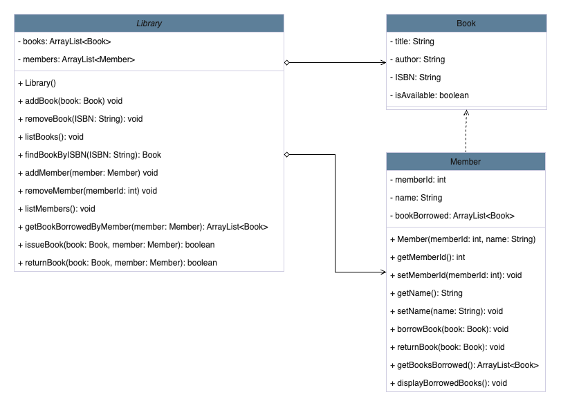

# 주제: 도서관 관리 시스템
## 클래스 설명:
### 도서관(Library)
#### 속성
> - books: 도서관의 모든 책을 저장하는 ArrayList입니다.
> - members: 라이브러리에 등록된 모든 구성원을 저장하는 ArrayList입니다.
#### 기능
> - addBook(book: Book): 라이브러리에 새 책을 추가합니다.
> - removeBook(ISBN: String): 도서관에서 책을 제거합니다.
> - listBooks(): 현재 도서관에 있는 모든 책을 나열합니다.
> - findBookByISBN(ISBN: String): Book: ISBN으로 책을 찾습니다.
> - addMember(member: Member): 라이브러리에 새 구성원을 추가합니다.
> - removeMember(memberId: int): 라이브러리에서 구성원을 제거합니다.
> - listMembers(): 현재 등록된 모든 구성원을 나열합니다.
> - getBooksBorrowedByMember(member: Member): ArrayList<Book>: 회원이 빌린 도서를 반환합니다.
> - issueBook(book: Book, member: Member): boolean: 회원이 책을 빌릴 수 있도록 합니다.
> - returnBook(book: Book, member: Member): boolean: 회원이 책을 반납할 수 있도록 합니다.

### 책(Book)
#### 속성
> - title: 책 제목을 나타내는 문자열입니다.
> - author: 책의 저자를 나타내는 문자열입니다.
> - ISBN: 도서의 ISBN(국제표준도서번호)을 나타내는 문자열입니다.
> - isAvailable: 책을 빌릴 수 있는지 여부를 나타내는 부울입니다.

#### 기능
> - title, author, ISBN 및 isAvailable에 대한 Getter 및 Setter 메서드.
> - toString(): 책의 문자열 표현을 반환합니다.

### 회원(Member)
#### 속성
> - memberId: 멤버의 고유 식별자를 나타내는 int입니다.
> - name: 멤버의 이름을 나타내는 문자열입니다.
> - booksBorrowed: 회원이 빌린 책을 저장하는 ArrayList입니다.

#### 기능
> - memberId 및 name에 대한 Getter 및 Setter 메소드.
> - borrowBook(book: Book) : 회원의 대출 목록에 책을 추가합니다.
> - returnBook(book: Book) : 회원의 대출 목록에서 책을 삭제합니다.
> - getBooksBorrowed(): 회원이 빌린 도서 목록을 반환합니다.
> - displayBorrowedBooks(): 회원이 빌린 도서의 내역을 출력합니다.

## UML 클래스 다이어그램

## 소스코드는 Q4 패키지 내의 .java 파일들 참고